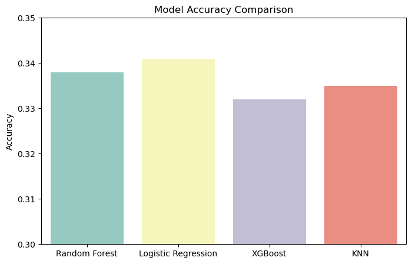
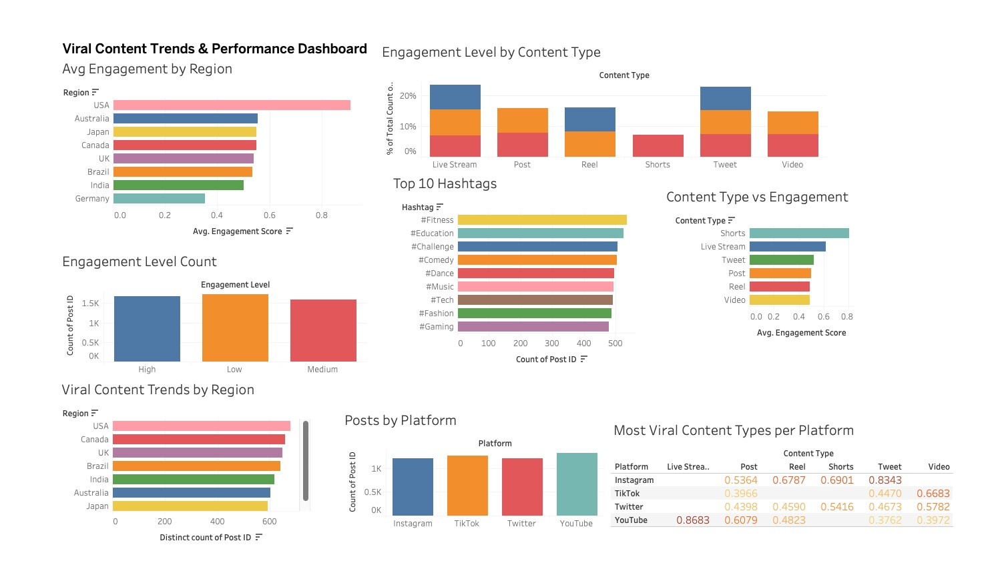

# 📊 Social Media Content Trends Analysis

This project analyzes viral content trends across social media platforms using data visualization, machine learning, and a Streamlit-powered interactive dashboard.

---

## 📂 **Project Structure**
📁 Social-Media-Content-Trends-Analysis  
├── 📂 data  # Raw and Processed Data Files  
│   ├── 📄 engineered_viral_trends.csv  
├── 📂 images  # Screenshots of Tableau and Visualizations  
│   ├── 📄 dashboard_screenshot.png  
│   ├── 📄 model_comparison.png  
├── 📂 notebooks  # Jupyter Notebooks for Analysis  
│   ├── 📄 social.ipynb  
├── 📂 streamlit_app  # Streamlit App Code  
│   ├── 📄 app.py  
├── 📂 tableau  # Tableau Project Files  
│   ├── 📄 social_media_proj.twb  
│   ├── 📄 social_media_proj.twbx  
├── 📄 requirements.txt  # Python Dependencies for Streamlit  
├── 📄 README.md  # Documentation (THIS FILE)  

---

## 🛠️ **1. Data Collection & Preprocessing (Jupyter Notebook)**
- Used a dataset containing **social media posts, engagement metrics (likes, shares, comments, views).**
- **Data Cleaning**: Handled missing values, standardized column names, and removed outliers.
- **Feature Engineering**: Created new metrics like `Engagement Score`.

📌 **Notebook**: [`notebooks/social.ipynb`](notebooks/social.ipynb)

---

## 📊 **2. Exploratory Data Analysis (EDA)**
- **Visualized platform-wise engagement trends** (Instagram vs TikTok vs Twitter vs YouTube).
- **Top trending hashtags** and their correlation with engagement.
- **Most effective content types** (Live Streams, Videos, Posts, Shorts).
- **Geographical engagement trends** (USA, UK, India, etc.).

📌 **Notebook**: [`notebooks/social.ipynb`](notebooks/social.ipynb)

---

## 📈 **3. Machine Learning Model Development**
- Built predictive models to analyze engagement patterns.
- Compared **Random Forest, Logistic Regression, XGBoost, and KNN** models.
- Evaluated model accuracy using **bar plots** and performance metrics.

🖼 **Model Accuracy Comparison**:  


📌 **Notebook**: [`notebooks/social.ipynb`](notebooks/social.ipynb)

---

## 📊 **4. Data Visualization (Tableau)**
- Developed **interactive dashboards** for trend analysis.
- Visualized **engagement metrics, top hashtags, and content effectiveness**.

🖼 **Tableau Dashboard Preview**:  


📌 **Tableau File**: [`tableau/social_media_proj.twbx`](tableau/social_media_proj.twbx)

---

## 🚀 **5. Streamlit Dashboard Deployment**
- Built an **interactive Streamlit app** to showcase insights dynamically.
- Implemented **filters for platform-wise analysis** and visualizations.

🌍 **Live Demo**: [Social Media Analysis App](https://social-media-content-trends-analysis.streamlit.app/)

📌 **Code**: [`streamlit_app/app.py`](streamlit_app/app.py)

---

## ⚙️ **Setup & Installation**
```sh
# Clone the repository
git clone https://github.com/KunalSuhanda/Social-Media-Content-Trends-Analysis.git
cd Social-Media-Content-Trends-Analysis

# Create and activate virtual environment
python -m venv venv
source venv/bin/activate  # On Windows use `venv\Scripts\activate`

# Install dependencies
pip install -r requirements.txt

# Run Streamlit Dashboard
streamlit run streamlit_app/app.py
```

---

## 🤝 **Contributing**
Feel free to open issues or submit pull requests!

---

## 🏆 **Acknowledgments**
- Data sourced from various social media platforms.
- Powered by **Python, Pandas, Seaborn, Matplotlib, Plotly, Scikit-learn, Tableau, and Streamlit**.
