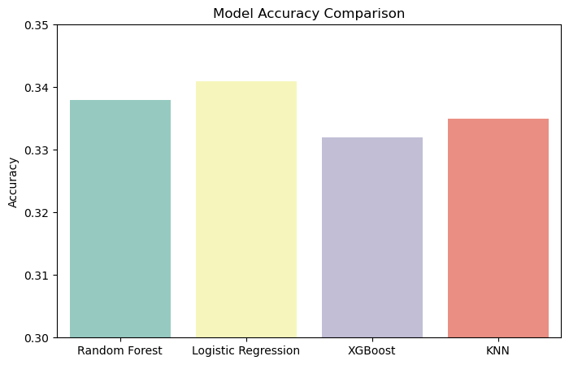
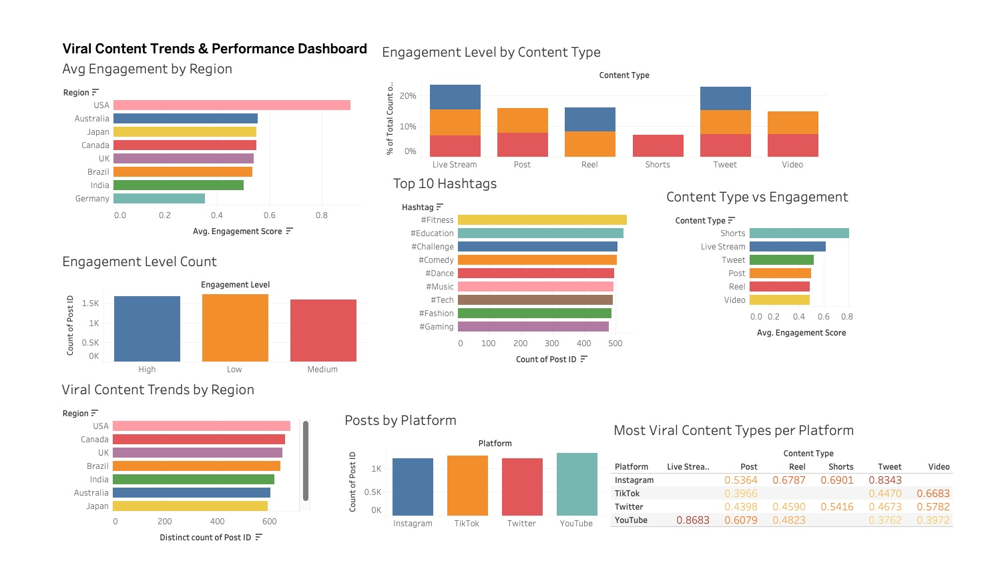

# 📊 Social Media Content Trends Analysis

This project analyzes social media content trends across various platforms, visualizes key insights using Tableau, applies machine learning for engagement prediction, and deploys an interactive dashboard using Streamlit.

---

## 🏗 **Project Structure**
📂 Social-Media-Content-Trends-Analysis  
 ├── 📂 data  # Raw and Processed Data Files  
 │   ├── 📄 engineered_viral_trends.csv  
 ├── 📂 images  # Screenshots of Tableau and Visualizations  
 │   ├── 📄 dashboard_screenshot.png  
 │   ├── 📄 model_comparison.png  
 ├── 📂 notebooks  # Jupyter Notebooks for Analysis  
 │   ├── 📄 social.ipynb  
 ├── 📂 streamlit_app  # Streamlit App Code  
 │   ├── 📄 app.py  
 ├── 📂 tableau  # Tableau Project Files  
 │   ├── 📄 social_media_proj.twb  
 │   ├── 📄 social_media_proj.twbx  
 ├── 📄 requirements.txt  # Python Dependencies for Streamlit  
 ├── 📄 README.md  # Documentation (THIS FILE)  

---

## ⚙️ **1. Data Collection & Preprocessing (Jupyter Notebook)**
- Used a dataset containing **social media posts, engagement metrics (likes, shares, comments, views, etc.)**.
- **Data Cleaning**: Handled missing values, standardized column names, and removed outliers.
- **Feature Engineering**: Created new metrics like `Engagement Score`.

📌 **Notebook**: [`notebooks/social.ipynb`](notebooks/social.ipynb)

---

## 📊 **2. Exploratory Data Analysis (EDA)**
- **Visualized platform-wise engagement trends** (Instagram vs TikTok vs Twitter vs YouTube).
- **Top trending hashtags** and their correlation with engagement.
- **Most effective content types** (Live Streams, Videos, Posts, Shorts).
- **Geographical engagement trends** (USA, UK, India, etc.).

📌 **Notebook**: [`notebooks/social.ipynb`](notebooks/social.ipynb)

---

## 🤖 **3. Machine Learning Model for Engagement Prediction**
- **Trained models** to predict engagement levels based on post features.
- Used **Random Forest, Logistic Regression, XGBoost, KNN**.
- **Best Model**: Logistic Regression performed the best with highest accuracy.

📊 **Model Comparison:**  


📌 **Notebook**: [`notebooks/social.ipynb`](notebooks/social.ipynb)

---

## 📈 **4. Data Visualization (Tableau)**
- Created interactive dashboards for engagement insights.
- **KPIs**: Total Posts, Average Engagement Score, Most Engaging Platform.

📊 **Dashboard Preview:**  


📌 **Tableau Project File**: [`tableau/social_media_proj.twbx`](tableau/social_media_proj.twbx)

---

## 🌐 **5. Streamlit Dashboard Deployment**
- Built an interactive **data dashboard** using **Streamlit**.
- Allows users to explore engagement trends, filter data, and visualize insights.

🚀 **Live Dashboard**: [Social Media Dashboard](https://social-media-content-trends-analysis.streamlit.app/)

📌 **Code**: [`streamlit_app/app.py`](streamlit_app/app.py)

---

## 🛠 **Setup & Installation**
```sh
# Clone the repository
git clone https://github.com/KunalSuhanda/Social-Media-Content-Trends-Analysis.git
cd Social-Media-Content-Trends-Analysis

# Create virtual environment (optional but recommended)
python -m venv venv
source venv/bin/activate  # On Windows use `venv\Scripts\activate`

# Install dependencies
pip install -r requirements.txt

# Run Streamlit Dashboard
streamlit run streamlit_app/app.py
```

---

## 🤝 **Contributing**
Feel free to open issues or submit pull requests!

---

## 🏆 **Acknowledgments**
- Data sourced from various social media platforms.
- Powered by **Python, Pandas, Seaborn, Matplotlib, Plotly, Scikit-learn, Tableau, and Streamlit**.
